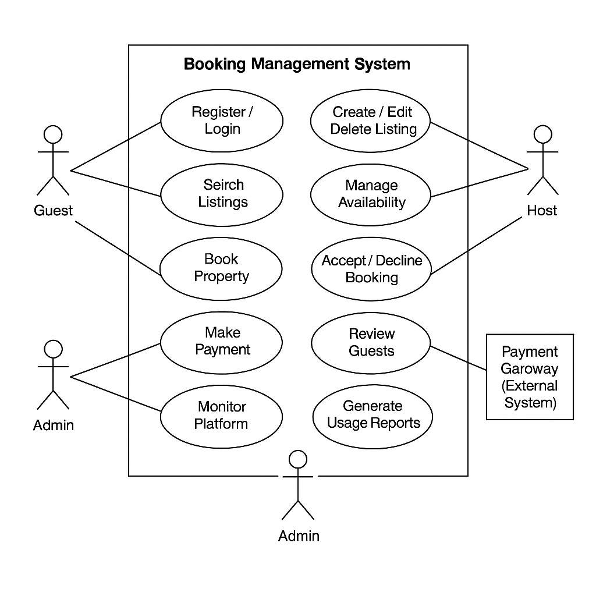

# Requirement Analysis in Software Development
This repository contains a structured and standards-compliant requirement analysis for a Booking Management System. It includes formal documentation of functional and non-functional requirements, system use cases, acceptance criteria, and supporting UML diagrams. The objective is to define a clear, verifiable blueprint that supports the software design and implementation phases in accordance with SDLC best practices.

## What is Requirement Analysis?

Requirement Analysis is the systematic process of identifying, documenting, validating, and managing the needs and expectations of stakeholders for a software system. It establishes a formal foundation upon which system design, implementation, and testing are built.

In the context of the Software Development Life Cycle (SDLC), Requirement Analysis serves as a critical phase following project initiation and preceding system design. It ensures that the development team fully understands *what* needs to be built and *why*. This includes translating high-level business goals into clear, actionable, and testable software requirements.

For a system such as an Airbnb-like booking platform, Requirement Analysis ensures clarity on features such as property listing, booking workflows, payment processing, user authentication, and review systems. It distinguishes between stakeholder expectations, business rules, and technical constraints to reduce ambiguity, prevent scope creep, and ensure traceability throughout the development lifecycle.

Effective Requirement Analysis results in a requirements specification that guides all downstream activities while ensuring the system meets user and business objectives with minimal rework and technical debt.

## Why is Requirement Analysis Important?

Requirement Analysis is a critical phase in the Software Development Life Cycle (SDLC) as it directly influences the correctness, efficiency, and maintainability of the final software product. Its significance can be articulated through the following core reasons:

### 1. Prevents Ambiguity and Misinterpretation

Well-defined requirements eliminate ambiguity by ensuring all stakeholders—business owners, developers, testers, and designers—operate with a unified understanding of system expectations. This reduces the likelihood of miscommunication, scope creep, and incorrect implementations.

### 2. Enables Accurate System Design and Planning

Requirement Analysis provides the technical foundation upon which architectural decisions, data modeling, and implementation strategies are built. Accurate, complete, and validated requirements allow the engineering team to produce system designs that are scalable, secure, and aligned with the intended business functionality.

### 3. Facilitates Testability and Traceability

Clearly articulated requirements serve as the baseline for developing acceptance criteria, test cases, and validation procedures. This ensures that every feature is verifiable against the original business intent, supports traceability from specification to implementation, and enhances the overall quality assurance process.

## Key Activities in Requirement Analysis

Requirement Analysis consists of a set of structured, methodical activities aimed at producing accurate, complete, and actionable requirements. The following are the five core activities involved:

- **Requirement Gathering**  
  The systematic process of collecting business needs, objectives, and constraints from all relevant stakeholders. This includes inputs from clients, end-users, product owners, and domain experts through techniques such as stakeholder interviews, document reviews, and observations.

- **Requirement Elicitation**  
  A structured approach to uncover implicit, latent, and unstated requirements. Elicitation techniques may include use case workshops, joint application design (JAD) sessions, questionnaires, and prototyping. The goal is to derive requirements that stakeholders may not have explicitly articulated.

- **Requirement Documentation**  
  The process of formally recording the gathered and elicited requirements in standardized formats such as Software Requirements Specifications (SRS), user stories, or use case descriptions. Documentation must be clear, unambiguous, complete, and verifiable to serve as a contractual reference for implementation and validation.

- **Requirement Analysis and Modeling**  
  Involves examining the documented requirements to identify inconsistencies, conflicts, redundancies, and feasibility issues. This phase also includes developing models such as data flow diagrams (DFDs), use case diagrams, entity-relationship diagrams (ERDs), and state machines to visualize and validate system behavior.

- **Requirement Validation**  
  The formal review process that ensures all documented requirements align with business objectives and are technically achievable within given constraints. Validation involves walkthroughs, peer reviews, stakeholder approvals, and traceability mapping to ensure completeness, correctness, and testability.

## Types of Requirements

Requirements in software engineering are categorized into two distinct types: **Functional Requirements** and **Non-functional Requirements**. This classification ensures clarity in system behavior definition and helps align technical implementation with stakeholder expectations.

### Functional Requirements

Functional requirements define the specific behaviors, features, and interactions the system must support. They describe *what* the system must do to fulfill user and business needs.

**Functional Requirements for the Booking Management System (Airbnb Clone):**

- The system shall allow users to register and authenticate as a host or a guest.
- Hosts shall be able to create, modify, and delete property listings with metadata such as title, description, images, amenities, pricing, and availability.
- Guests shall be able to search for available listings by location, date range, price, and amenities.
- The system shall enable guests to initiate a booking request for a selected property and receive confirmation upon successful processing.
- The system shall allow hosts to accept or decline booking requests within a defined time window.
- The system shall integrate with a secure payment gateway to process booking transactions.
- Users shall be able to view booking history and cancel upcoming bookings under defined conditions.
- The system shall support a two-way review mechanism after a completed stay (guest and host).

### Non-functional Requirements

Non-functional requirements specify *how* the system performs its functions. They define quality attributes, constraints, and operational characteristics that the system must satisfy.

**Non-functional Requirements for the Booking Management System (Airbnb Clone):**

- **Scalability**: The system shall handle at least 10,000 concurrent users with no degradation in performance under normal operating conditions.
- **Performance**: Page load times shall not exceed 2 seconds for 95% of all user interactions.
- **Availability**: The system shall maintain ≥99.9% uptime, with automatic failover across availability zones.
- **Security**: All user data, credentials, and payment information shall be transmitted using TLS 1.2+ and stored using encryption-at-rest mechanisms (e.g., AES-256).
- **Responsiveness**: The application shall be fully responsive and optimized for mobile, tablet, and desktop interfaces.
- **Accessibility**: The platform shall conform to WCAG 2.2 AA standards to support users with visual, auditory, or motor impairments.
- **Compliance**: The system shall comply with data privacy regulations such as GDPR and allow users to delete their accounts and personal data on request.
- **Auditability**: The system shall log all critical actions (authentication, booking, payment, cancellations) for a minimum of 12 months for traceability.

## Use Case Diagrams

A Use Case Diagram is a behavioral modeling technique from the Unified Modeling Language (UML) used to represent the functional interactions between external actors and the system. It captures high-level user goals (use cases) and how different types of users interact with the system to fulfill those goals.

Use Case Diagrams are essential during the requirement analysis phase because they:
- Offer a clear, visual representation of system scope and user roles.
- Improve stakeholder communication by abstracting technical complexity.
- Serve as a blueprint for identifying key functional requirements and test cases.

Below is the use case diagram for the booking management system (Airbnb clone), illustrating primary actors and their interactions with the system:

## Acceptance Criteria

Acceptance Criteria are explicit, measurable conditions that a software product must satisfy to be accepted by stakeholders. They define the boundaries of a user story or requirement and serve as the basis for validation, testing, and sign-off. Properly defined acceptance criteria ensure that developers, testers, and stakeholders share a common understanding of what constitutes a completed and acceptable feature.

### Importance of Acceptance Criteria in Requirement Analysis

- **Ensures Functional Clarity**: Acceptance criteria disambiguate requirements by specifying exact behaviors and edge conditions.
- **Facilitates Testability**: Criteria are typically used to write automated or manual test cases during verification and validation phases.
- **Drives Development Scope**: Well-defined criteria help prevent scope creep by setting clear boundaries for each deliverable.
- **Aligns Stakeholders**: Acts as a shared contract between product owners, developers, and testers, reducing communication overhead and rework.
- **Improves Quality Assurance**: Establishes objective standards for quality and completeness before a feature is released.

### Example: Acceptance Criteria for Checkout Feature

**Feature**: Property Checkout (Booking Confirmation)

| ID | Acceptance Criterion | Type | Priority |
|----|----------------------|------|----------|
| AC-CHK-01 | The system must display a summary of booking details (dates, guest count, total cost) before confirmation. | Functional | High |
| AC-CHK-02 | Guests must be able to select a valid payment method and submit payment securely using TLS 1.2+ encryption. | Functional / Security | High |
| AC-CHK-03 | The booking must be recorded in the database and marked as “confirmed” only after successful payment processing. | Functional | High |
| AC-CHK-04 | The system must send confirmation emails to both guest and host within 30 seconds of successful checkout. | Non-functional (Performance) | Medium |
| AC-CHK-05 | If payment fails, the system must not reserve the property and must display a clear error message with retry options. | Functional / UX | High |
| AC-CHK-06 | The system must prevent duplicate bookings for the same property and date range. | Functional / Integrity | High |

---

These acceptance criteria follow the INVEST principle—**Independent, Negotiable, Valuable, Estimable, Small, and Testable**—and are ready to be translated into automated test cases or manual test scripts.

